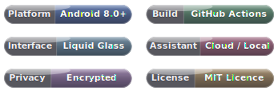

<div align="center">

# 𝓛𝓾𝓬𝓮𝓷𝓽

### Modern · Minimalist · Quietly Overqualified

**A notes-and-tasks app with an assistant that can actually touch your data —
sealed in an encrypted database on your own device, fluent in four languages, and built
from start to finish by pressing one button on GitHub and going off to put the kettle on.
It comes in pocket and desk sizes alike — an Android APK and a Windows installer — with the
same shared heart ready to travel further.**



</div>

---

## The general idea

Most note-taking apps offer you a sporting choice of two from three: the pretty one, the private
one, or the clever one. Pick any two and learn to live with the disappointment. Lucent politely
declines this arrangement. Everything you write is sealed in an encrypted database that never leaves
your device. The assistant can be a cloud model you pay for, a model running entirely on the machine
in front of you, or — if you are the sort of person who keeps notes the way one keeps a diary, which
is to say resentfully and alone — nothing at all. And the whole thing is assembled without a line of
local tooling: you press a button on GitHub, wander off, and an APK or a Windows `.exe` installer is
waiting when you return.

It is, we admit, a lot of app for a to-do list. We have made our peace with this.

## One app, wherever you put it

Lucent is **one product with a single shared heart**, and the house rule of this repository is that
every feature lands on every platform it ships to. Today that means your pocket and your desk:

- **`:app`** — the Android application (Kotlin + Jetpack Compose, Room/SQLCipher, llama.cpp via the
  NDK). Built by `.github/workflows/build.yml` into a signed release APK.
- **`:desktop`** — the desktop application, Windows today (Compose for Desktop, pure JVM, the same
  shared Kotlin de-Android-ified with a thin shim layer, SQLite over JDBC, llama.cpp compiled as a
  DLL). Built by `.github/workflows/build-windows.yml` into a double-click `.exe` installer.

The desktop module is self-contained: it carries its own copies of the shared screens and data
layer, small `android.*`/`androidx.*` shims for the platform APIs Compose Desktop doesn't have, and
native replacements where the platform genuinely differs — file dialogs instead of SAF pickers, a
system tray instead of a foreground service, and **Windows Hello** standing in for fingerprint
unlock on the app lock. The same pattern — shared core, thin shell — is what lets the product reach
further afield without rewriting itself each time.

## Notes that remember what they used to be

A note is a title, a body, some tags, a colour, and — should prose feel like too much commitment on
a Monday — a checklist instead. Checklist items are first-class citizens: they can be reworded in
place after the fact, opened in a roomy pop-out editor when a "quick item" turns into a paragraph,
and an item you typed but never got around to confirming with "+" is still saved rather than
quietly abandoned. Beyond the basics, notes do the things you only miss once they're gone:

- **Version history.** Every meaningful edit is snapshotted, so you can read exactly what a note
  said last Tuesday and restore it when today's confident rewrite turns out to have been a mistake.
  It usually was.
- **Links between notes.** Type `[[Shopping list]]` and it becomes tappable; the note you pointed at
  grows a *linked from* reference in return. Point at a title that doesn't exist yet and the link
  shows red — tap it, and that note is politely brought into existence.
- **Markdown, entirely optional.** Headings, bold, code and lists render when you want them and stay
  exactly as typed when you don't.
- **Templates.** Four one-tap starters — journal, meeting notes, project idea, checklist — offered
  only on a blank note and never, ever over your actual work.
- **Archive and trash, kept firmly separate**, because "I am finished with this" and "I would like
  this gone" are different sentiments, and conflating them is how things you wanted end up in the
  bin.

## Tasks with due dates that actually mean something

Subtasks, priorities, repeat schedules, and reminders that survive a reboot. Due dates are parsed
from ordinary language, so *next Friday at 6* becomes a genuine timestamp with a genuine alarm
attached. Subtasks get the same grown-up checklist treatment notes do — editable in place, pop-out
editing, never lost to a forgotten "+" — and marking a task complete ticks its whole checklist off
with it, because a "done" task with three unticked steps is a contradiction wearing a checkmark.
Completed tasks take themselves off to their own screen instead of loitering at the bottom of the
list; if one turns out not to be finished after all, it can be sent back.

## An assistant with hands, not merely opinions

Bring your own model. Lucent speaks the OpenAI, Anthropic, and Google request shapes fluently,
fetches the live model list from whichever endpoint you point it at, and lets you keep **several
API profiles** to switch between with a single tap.

What makes it genuinely useful is that it can *act*. A large and growing set of tools is wired to
your real data, and the assistant can do essentially everything you can do by hand: create, read,
edit, colour, archive, pin and delete notes; create, complete, reopen, schedule, prioritise and
delete tasks; work through checklists item by item — on tasks *and* on checklist notes — adding,
ticking, rewording and removing entries; search with proper filters; and attach or remove files.
Crucially, before it changes anything it shows you precisely what it intends to do, in your own
language, and waits for a yes like a butler hovering at a respectful distance. Replies stream in as
they're written, conversations are kept and switchable, and you decide how much history rides along
with each message.

## Or run the whole thing on the device itself

Feeling anti-social, or simply on a train through a tunnel? Import a `.gguf` file — or a `.zip`
with one inside, which is unpacked for you — and the assistant answers using **llama.cpp running
directly on the device**. No account, no API key, no network. The model is unloaded the moment you
leave the app. Roughly 1–4 GB Q4 models hit the sweet spot on a typical phone; a desktop with more
RAM can afford more optimism.

Two things about on-device mode are yours to decide, and both default to the cautious option:

- **Tools are opt-in.** Off by default, because driving the tool protocol costs extra thinking per
  reply. Turn them on in Settings — after a short, honest warning — and the local assistant can edit
  your notes and tasks exactly like the cloud one, network or no network.
- **CPU or GPU, your call.** It runs on the CPU by default, which works everywhere and whose
  worst-case behaviour is "a bit slow" rather than "a bit on fire". Switch it to the GPU (Vulkan) —
  again after a warning — and if your particular graphics driver disagrees with the whole idea, it
  quietly falls back to the CPU. On Windows the installer ships a CPU engine and, where the build
  can produce it, a second Vulkan-enabled engine; the app picks the GPU build only on machines that
  actually have the Vulkan runtime, so nothing ever breaks on the ones that don't.

Web search and cross-conversation memory stay off on device throughout, on purpose.

## Four languages, switched without ceremony

English, Simplified Chinese, Japanese, and Korean — the entire interface, every dialog, toast, and
accessibility label, with English as the sensible default and the others a tap away. Switching
is immediate: no restart, no reload. It studiously never touches your content — your notes, your
tasks, and the assistant's replies stay in whatever language you wrote them. Each script also
brings **three typefaces of its own**, labelled in their native names.

## Privacy that is structural, not merely promised

- The database is **encrypted at rest** — SQLCipher on Android — and attachments are encrypted
  individually on disk.
- **App lock** with an optional security question, where neither the password nor the answer is
  ever stored — only a salted hash. On Android the lock opens to your fingerprint; on Windows, to
  **Windows Hello**.
- **Backups** are a single encrypted `.lcb` file holding notes, tasks, history, chats, attachments
  and settings — portable between devices, password-protectable, and previewed before a single item
  is changed on import.
- Share-sheet integration is off by default, and diagnostic logging is both off by default and
  stubbornly local-only.
- Exports are the one deliberate exception — **Markdown, Word, PDF, or Excel**, unencrypted —
  because a file you cannot open anywhere else is not an export; it is a hostage.

## Made, rather unashamedly, of glass

Soft blobs of colour drift behind frosted panels that blur whatever passes beneath them. A generous
spread of palettes across solid, gradient, and classic families, or an auto-cycle that ambles
through the lot; light, dark, system, and Monet-tinted themes. On Android, home-screen widgets carry
the same glassy surface out to your launcher; on Windows, the app minimises to a tray icon and the
sidebar takes over from the bottom tab bar, because a 27-inch monitor deserves better than a phone
layout stretched sideways.

## Rust, but only where it earns its keep

Two hot paths are written in Rust and reached through JNI from the shared code: the PBKDF2 +
AES-256-GCM routines behind backups and attachment encryption, and the maths that keeps the
background animation drifting smoothly. Both fall back to identical Kotlin automatically when the
native library isn't present.

## Building it (yes, from a phone, in your dressing gown)

No Android Studio, no local SDK, no command line.

- **Android:** push to GitHub, open **Actions → Build signed release APK → Run workflow**, and
  download the signed APK when the tick turns green. The final step runs `apksigner` and refuses
  the build if the result isn't a properly signed release. The signing key lives in encrypted
  repository secrets.
- **Windows:** open **Actions → Build Windows desktop → Run workflow**, and download the `.exe`
  installer artifact. The workflow compiles the llama.cpp engine (CPU always; Vulkan GPU
  best-effort) and the Rust accelerator on the runner — all three native builds are optional, so a
  hiccup in any of them still leaves you with a working installer.

## Project layout

```
app/          Android module (:app) — UI, data layer, i18n, JNI bridges, widgets
desktop/      Desktop module (:desktop) — Compose for Desktop shell, shims, shared-code copies,
              native CMake build for the engine DLL
rust/         The Rust accelerator (shared across platforms)
.github/      build.yml (Android APK) and build-windows.yml (Windows installer)
```

Everything user-visible is localised through `i18n/I18n.kt` — one catalogue per platform copy, four
languages, compile-checked keys — and those translation tables are where the interface's every word
actually lives.

## With thanks to the giants whose shoulders these are

Underneath the glass, Lucent is a great deal of other people's excellent work. It would be poor
manners — and, in one or two cases, an outright licence violation — not to say so out loud. The full
texts and copyright notices live in **[`THIRD-PARTY-NOTICES.md`](./THIRD-PARTY-NOTICES.md)**; the
short version, with our gratitude, is this:

| Borrowed brilliance | Doing the job of | Under |
|---|---|---|
| [Kotlin](https://github.com/JetBrains/kotlin) & [Coroutines](https://github.com/Kotlin/kotlinx.coroutines) | the language, and its patience with concurrency | Apache-2.0 |
| [Jetpack Compose & AndroidX](https://developer.android.com/jetpack/androidx) | the Android half of the interface | Apache-2.0 |
| [Compose Multiplatform & Skiko](https://github.com/JetBrains/compose-multiplatform) | the desktop half of the interface | Apache-2.0 |
| [Material Icons](https://github.com/google/material-design-icons) | the small pictures that mean things | Apache-2.0 |
| [Haze](https://github.com/chrisbanes/haze) — © Chris Banes | all that fashionable blur | Apache-2.0 |
| [OkHttp](https://github.com/square/okhttp) — © Square, Inc. | talking to the cloud | Apache-2.0 |
| [Apache PDFBox](https://pdfbox.apache.org/) | PDFs on the desktop | Apache-2.0 |
| [SQLite JDBC](https://github.com/xerial/sqlite-jdbc) — © Taro L. Saito et al. | the desktop's way into SQLite | Apache-2.0 |
| [SQLite](https://www.sqlite.org/) | the database itself, quietly running the world | Public Domain |
| [SQLCipher](https://www.zetetic.net/sqlcipher/) — © Zetetic LLC | the lock on that database, on Android | BSD-style |
| [llama.cpp & GGML](https://github.com/ggml-org/llama.cpp) — © Georgi Gerganov & contributors | an entire language model, on your own silicon | MIT |
| [org.json](https://github.com/stleary/JSON-java) — © JSON.org | reading JSON on the desktop | JSON License |
| The bundled fonts — Noto Serif SC, JetBrains Mono, and their kin | every letter you read | SIL OFL 1.1 |

A particular word for **SQLCipher**, whose BSD-style licence asks — not unreasonably, given it is
the thing keeping your diary shut — that its copyright and notice be reproduced somewhere a user can
actually find them. So they are, in the notices file above; if you ship a build of Lucent, keep them
findable. The Open Font License extends its bundled fonts the same courtesy: use and adapt them
freely, but don't sell them on their own, and leave their reserved names to their authors.

## Licence, and the one small thing it asks in return

Lucent is released under the **MIT Licence** — see [`LICENSE`](./LICENSE). Do very nearly whatever
you like with it: use it, change it, fold it into something commercial, build something better on
top and never write to thank us. The single, entirely reasonable condition is that our copyright
notice and the licence text come along for the ride in any copy or substantial portion of the code —
so if you reuse Lucent, keep the `LICENSE` file (and the name on it) with what you ship, and we are
square. The third-party components above make their own, similarly modest requests; honour those in
the same spirit and everyone stays friends.
